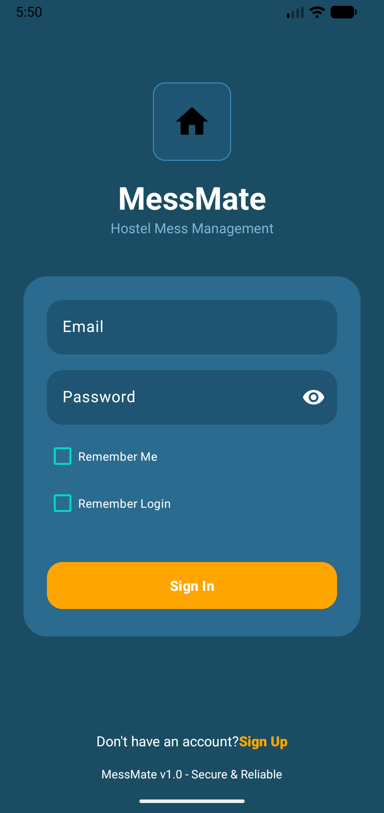
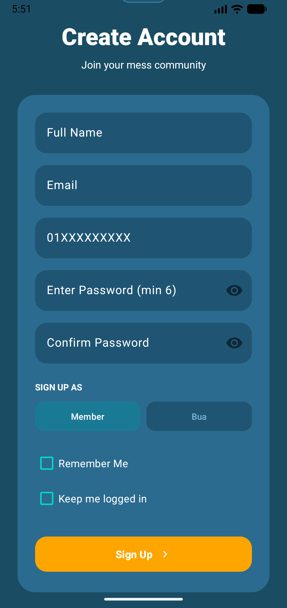
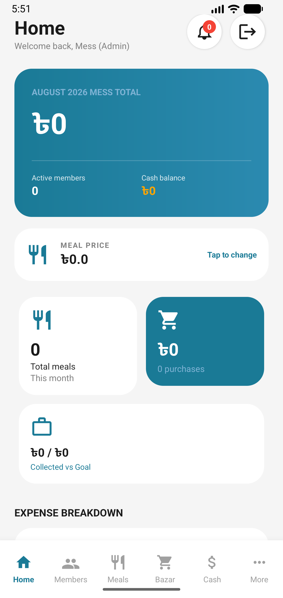
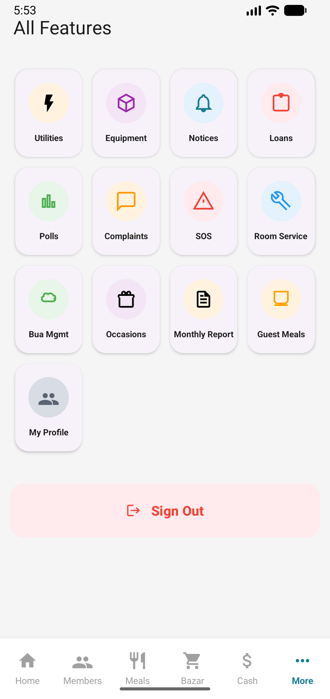

# 🏢 Mess Management System

An intuitive, feature-rich Android application designed to streamline daily mess, hostel, and shared-apartment operations. From meal tracking and grocery shopping to house-help management, utility split calculations, and financial reports, **Mess Management System** makes shared living effortless and transparent.

---

## 📱 App Screenshots

| 🔐 Login | 📝 Sign Up | 🏠 Home Dashboard | 🎛️ All Features |
| :---: | :---: | :---: | :---: |
|  |  |  |  |

---

## ✨ Key Features

### 📊 Dashboard & Financial Summary
* **Real-time Stats:** Track total cash balances, current meal rate, active member count, and individual deposits.
* **Quick Actions:** Instant access to meal routines, bazar updates, and expense logs directly from the home screen.

### 🛒 Daily Meal & Bazar Management
* **Grocery (Bazar) Tracker:** Log daily grocery purchases, items bought, total expenditure, and buyer details.
* **Meal Routine & Guest Meals:** Record daily breakfast, lunch, and dinner counts along with guest meal additions.

### 🧹 House-Help (Bua) & Utility Tracking
* **Bua Management:** Track maid/house-help attendance, monthly salaries, advances paid, and task routines.
* **Utility Splitter:** Split shared bills (Rent, Electricity, Water, Gas, Internet) easily among mess members.

### 📈 Monthly Reports & Community Tools
* **Monthly Expense Analytics:** Visual financial breakdowns and monthly meal rate reports powered by MPAndroidChart.
* **Notice Board & Polls:** Post official announcements and conduct group votes for collective mess decisions.
* **Complaints & Maintenance:** Submit issue tickets for room service, repairs, or mess rules violation.
* **SOS Emergency Helpline:** One-touch access to essential emergency contacts and helpline numbers.

---

## 🛠️ Tech Stack

* **Platform:** Android (Java / Kotlin)
* **Minimum SDK:** API 27 (Android 8.1)
* **Target SDK:** API 37
* **Database:** Local SQLite (`SQLiteOpenHelper`)
* **UI Components:** Android XML & Material Design 3
* **Charts & Analytics:** MPAndroidChart (v3.1.0)
* **Architecture:** MVC / Activity-Adapter Pattern

---

## 📁 Project Structure

```
Mess-Management/
├── app/
│   ├── src/
│   │   └── main/
│   │       ├── java/com/project/messmanagement/
│   │       │   ├── MainActivity.java         # Primary Dashboard
│   │       │   ├── BazarActivity.java        # Grocery & Expense Tracker
│   │       │   ├── MealRoutineActivity.java  # Daily Meal Logging
│   │       │   ├── BuaManagementActivity.java# House-help Attendance & Salary
│   │       │   ├── UtilityActivity.java      # Utility Bills Management
│   │       │   ├── MonthlyReportActivity.java# Analytics & Financial Reports
│   │       │   ├── DatabaseHelper.java       # SQLite Database Core
│   │       │   └── ...                       # Feature Activities & Adapters
│   │       └── res/                          # XML Layouts, Drawables & Values
│   └── build.gradle.kts
└── Screenshots/                              # UI Showcase Screenshots
```

---

## 🚀 Getting Started

### Prerequisites
* **Android Studio** (Ladybug / Koala or newer recommended)
* **JDK 11** or higher
* **Android SDK** API 37

### Installation
1. **Clone the Repository:**
   ```bash
   git clone https://github.com/Pulok-Akibuzzaman/Mess-Management.git
   ```
2. **Open in Android Studio:**
   - Select **Open an existing project** and choose the `Mess-Management` root folder.
3. **Gradle Sync & Build:**
   - Allow Android Studio to sync the Gradle dependencies.
4. **Run Application:**
   - Connect your Android device or start an Emulator (API 27+), then click **Run (Shift + F10)**.

---

## 📄 License

This project is created for educational and practical mess management purposes. Feel free to use and customize it according to your needs.
